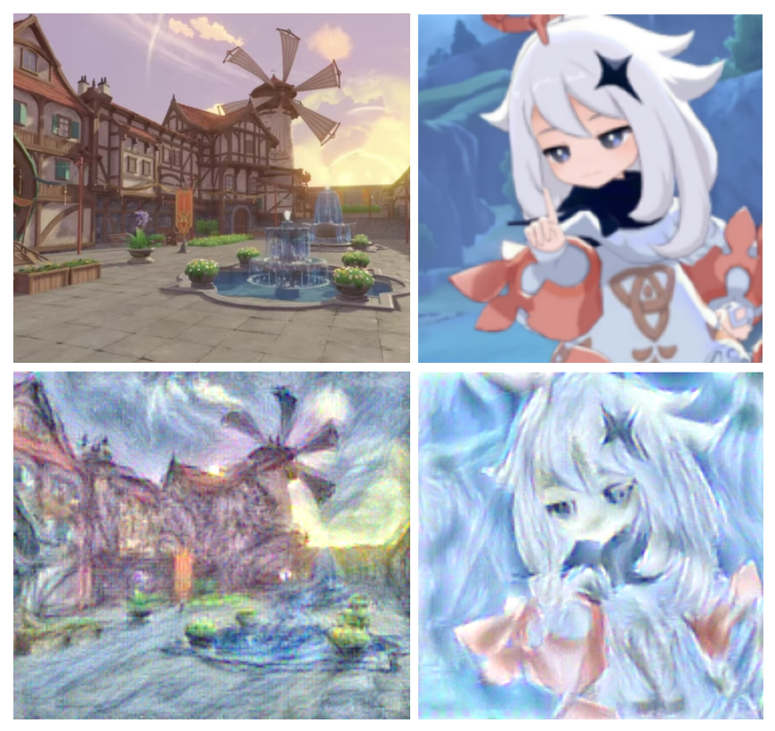

# 梵高“画笔下”的原神——基于风格迁移机器学习算法

## 1. 问题背景
图像风格迁移是计算机视觉中兼具科技理性与艺术美感的一项技术，其中2015年Gatys等人的工作尤为重要。本文基于Gatys等人的工作，通过计算内容损失和风格损失构建画家梵高的风格迁移图像。并且，基于CS224n课程的内容刻画了TV损失，使得整个风格迁移结果更为平顺。通过数值计算、梯度下降，我们使梵高的画笔再一次灵动于纸上，跨时空为《原神》勾勒出新的轮廓。
## 2. 代码使用
主要代码见StyleTransfer-core.ipynb文件，更多算法内容和结果见报告main.pdf,北太天元核心代码示例见example.m
## 3. 参考资料
1.	Image Style Transfer Using Convolutional Neural Networks (Gatys et al., CVPR 2015)https://www.cv-foundation.org/openaccess/content_cvpr_2016/papers/Gatys_Image_Style_Transfer_CVPR_2016_paper.pdf
2.	斯坦福CS231n课程资料：https://cs231n.github.io/
3.	原神官网：https://ys.mihoyo.com/
## 4. 致谢
特别感谢北京大学卢朓老师和助教张晨晔学长！
